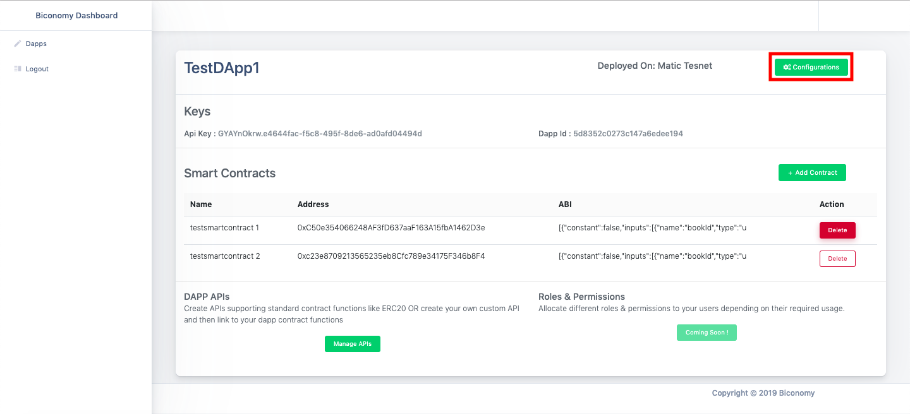

# Biconomy Dashboard

## Introduction

Biconomy Dashboard allows developers to register their DApps \(Decentralized Applications\), smart contracts and select methods/api on which a developer wants to enable meta transactions or gasless transactions.

The dashboard provides features like Limits \(Coming soon\) on meta transaction usage using a Limit Module on the DApp level, User level and API per user level.

We provide developers Statistics \(Coming soon\) related to his/her DApp such as Daily Active Users, Daily New Users, Gas fee usage per time duration, Daily transactions, etc in a graphical representation.

## Let’s Get Started

### Register Account

* Go to [https://dashboard.biconomy.io/](https://dashboard.biconomy.io/). Enter your email ID and password to register

* After Successful Registration, the user will be redirected directly to the Dashboard Home Page.
* On Home Page, verify your email first. Without email verification, you will not be able to register DApps.

* You will get OTP to your registered email address, enter the same on the verify email pop-up on the dashboard.

Now you can register your DApps and enable meta transactions.

### 

### Register a DApp

The developer can register a DApp just by using a DApp name and network on which the DApp is deployed. In the Alpha version, Ropsten and Matic Testnet are supported.

* Login to [Biconomy Dashboard](https://dashboard.biconomy.io/).
* On the Home page, click on “Register” and a pop-up will open.
* Enter your DApp Name and select a network.

* Click “Create” to register your DApp.

After DApp creation, you’ll have a **DApp ID** and an **API Key** generated. Copy these values as you’ll be needing them when you integrate Biconomy SDK \(Mexa\) in your DApp interface.

### Add Smart Contracts

After the DApp is created, you need to register your smart contracts now. All you need is your deployed smart contract address and ABI \(Application Binary Interface\).

* After DApp registration, on the home page, click “View DApp”.
* On the DApp details page, click “Add contract” to add a smart contract on which you want to enable Meta-transaction.

* On the “Add Smart Contract” page, enter the contract name, address and ABI, then click “Add”.

* After smart contract addition, you will be redirected to the DApp details page where you can see the added contract in the “Smart Contracts” section.
* There is a “Delete” option to delete the same.

**Note:** You can add multiple smart contracts in a DApp.

### Add APIs

After the Smart Contracts are added, the last step you need to do is to select and add meta APIs i.e., your smart contract methods on which you need to enable meta transactions.

If you don’t add any API, meta transaction functionality will not be applied to your smart contract.

Follow below steps to add an API

* On “View DApp” page, under “DApp APIs” section, click on “Manage APIs”

* Click “New API”, select Smart Contract, Method \(for which you want to enable meta transactions\), enter the name of your API then click “Add”.

* Your API will not persist in the database at this point of time.
* You can add more than one API. Added APIs will be visible at the bottom. Click on “Save” to persist them in database.

Congratulations! You have now successfully registered your DApp on the Mexa dashboard and enabled the meta transaction feature. The next step is to integrate Mexa SDK in your DApp code.

### Domain Restrictions

In order to prevent anyone from sending transactions using your API Key and misuse your funds, we suggest you set up domain restrictions on your dapp so only the requests coming from your domain will be entertained and others will be rejected.

* On the DApp details page, click on “Configurations” on top right.

* Click on “ Add URL” to add your domain and enter your Domain URL.

* Click on “Register” to add your domain url.

## 

## Coming Soon ...

### Limits

In order to prevent misuse of your funds by DApp users, the Mexa dashboard provides a Limit feature using which you can set limits on the usage of meta transactions on DApp level, User level, and API level.

This feature will be added soon on the dashboard.

### Statistics

On statistics screen, you’ll be able to see your DApp usage data like Daily new users, daily active users, gas usage per duration of time, gas usage per API of your dapp and more useful data to enable you to take appropriate decision to improve your DApp experience.

